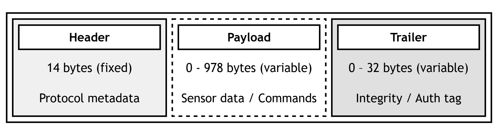
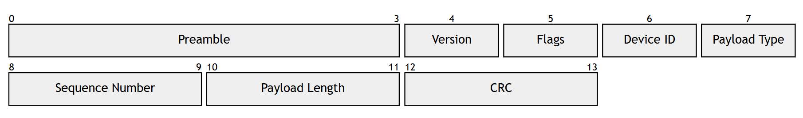

# Inertial Navigation Data Transfer Protocol (INDTP)

**Inertial Navigation Data Transfer Protocol (INDTP)** - is a lightweight, binary application-layer
(L7) protocol designed specifically for the **Inertial Navigation Systems (INS)** and autonomous platforms.

**INDTP** addresses the critical trade-off between low-latency real-time data streaming, robustness
against the noise, and cryptographic security.
The protocol features a compact fixed size header, support for data aggregation
in order to minimize overhead at high sampling rates, and a flexible multimode security architecture.

## 🎯 Why INDTP?

**INDTP** solves the problem of **unifying data exchange** between different navigation stacks, ensuring reliable, secure, and temporally synchronized data exchange under
diverse operational conditions.

## ⚙️ Core features

- **Time-critical accuracy**: Absolute and delta timestamps embedded in payload
ensure that sensor fusion and trajectory estimation algorithms receive precise
measurement times without transmission latency issues.
- **Hardware optimized**: Uses **CRC-16-MCRF4XX** and **CRC-32-AUTOSAR** - both supported by
hardware accelerators on modern MCUs.
- **Scalable protection**:

| Mode     | Trailer                   |  Use case                            | Overhead  |
|----------|---------------------------|--------------------------------------|-----------|
| Lite     | None (CRC-16 header only) | Trusted internal buses (SPI/I2C/CAN) | 0 bytes   |
| Verified | CRC-32-AUTOSAR            | Noisy wireless (BLE, LoRa)           | 4 bytes   |
| Trusted  | CMAC-AES-128              | Anti-spoofing                        | 8 bytes   |
| Critical | HMAC-SHA256               | Firmware updates, critical commands  | 32 bytes  |

- **Data aggregation mode**: Pack multiple samples per frame & reduce per-sample timestamp overhead.
- **Standard payloads**: Protocol supports several standard payloads that cover most of the uses and ready to use out the box. All in **SI** units and in **NED** coordinate frame.
- **Extensible:**: Reserved vendor-specific range of payload types enables
custom payloads for proprietary hardware and extended functionality.

---

## 📄 Documentation

For complete technical implementation of protocol
read [technical specification v1.0](docs/SPECIFICATION.md).

## 📦 Implementations

- **[Rust Implementation](lib/rust)**:
  - Fully `no_std` compatible. Designed specifically for memory-safe embedded environments.
  - Zero-allocation crate.
  - Minimal external dependencies.
  - Pluggable crypto/integrity engine traits for hardware acceleration.

## 📜 License

Copyright (C) 2026-present indtp project and contributors.

Licensed under the Apache License, Version 2.0 (the "License");
you may not use this file except in compliance with the License.
You may obtain a copy of the License at

<http://www.apache.org/licenses/LICENSE-2.0>

Unless required by applicable law or agreed to in writing, software
distributed under the License is distributed on an "AS IS" BASIS,
WITHOUT WARRANTIES OR CONDITIONS OF ANY KIND, either express or implied.
See the License for the specific language governing permissions and
limitations under the License.
