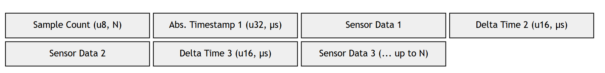

# Inertial Navigation Data Transfer Protocol (INDTP) Specification v1.0

## Table of Contents

- [1. Abstract](#1-abstract)
- [2. Terminology](#2-terminology)
- [3. Frame Architecture](#3-frame-architecture)
  - [3.1. Format](#31-format)
  - [3.2. Maximum Transmission Unit (MTU)](#32-maximum-transmission-unit-mtu)
- [4. INDTP Header](#4-indtp-header)
  - [4.1. Header Structure](#41-header-structure)
  - [4.2. Byte Order](#42-byte-order)
  - [4.3. Fields Descriptions](#43-fields-description)
  - [4.4. Protocol Operating Modes](#44-protocol-operating-modes)
    - [4.4.1. Lite Mode](#441-lite-mode)
    - [4.4.2. Verified Mode](#442-verified-mode)
    - [4.4.3. Trusted Mode](#443-trusted-mode)
    - [4.4.4. Critical Mode](#444-critical-mode)
  - [4.5. Timestamp and Batching Strategy](#45-timestamp-and-batching-strategy)
  - [4.6. Sequence Number Wrap-Around Handling](#46-sequence-number-wrap-around-handling)
    - [4.6.1. Algorithm Description](#461-algorithm-description)
  - [4.7. Payload Types](#47-payload-types)
    - [4.7.1. Standard Payload Types](#471-standard-payload-types)
    - [4.7.2. Vendor-Specific Payload Types](#472-vendor-specific-payload-types)
    - [4.7.3. Physical Units and Coordinate Conventions](#473-physical-units-and-coordinate-conventions)
- [5. Security](#5-security)
  - [5.1. Encryption](#51-encryption)
    - [5.1.1. Algorithm](#511-algorithm)
    - [5.1.2. Integrity of Encrypted Data](#512-integrity-of-encrypted-data)

## 1. Abstract

`Inertial Navigation Data Transfer Protocol (INDTP)` - is a lightweight, binary application-layer
(L7) protocol designed specifically for the **Inertial Navigation Systems (INS)** and autonomous platforms.

INDTP addresses the critical trade-off between low-latency real-time data streaming, robustness
against the noise, and cryptographic security.
The protocol features a compact fixed size header, support for data aggregation
in order to minimize overhead at high sampling rates, and a flexible multimode security architecture.

INDTP serves as a unified communication standard for modern navigation stacks, ensuring reliable, secure, and temporally synchronized data exchange under
diverse operational conditions.

## 2. Terminology

The key words "**MUST**", "**MUST NOT**", "**REQUIRED**", "**SHALL**", "**SHALL NOT**", "**SHOULD**", "**SHOULD NOT**", "**RECOMMENDED**",  "**MAY**", and "**OPTIONAL**" in this document are to be interpreted as described in [RFC 2119](https://www.rfc-editor.org/rfc/rfc2119).

## 3. Frame Architecture

## 3.1. Format

Frame - is a data exchange unit of INDTP.
Every frame consists of three distinct sections: a fixed-size header, a variable-size payload, and a mode-dependent trailer.

| Section | Size (Bytes) | Description                                |
|---------|--------------|--------------------------------------------|
| Header  | 14           | Protocol metadata                          |
| Payload | 0 - 978      | Vendor-specific data                       |
| Trailer | 0 - 32       | Cryptographic tag or integrity check value |
|         |              |                                            |

## 3.2. Maximum Transmission Unit (MTU)

The total INDTP frame size (header + payload + trailer) **MUST NOT** exceed **1024** bytes.
This size was chosen in order to fit well within the common Ethernet MTU (1500 bytes) avoiding
link‑level fragmentation that can lead to increased latency.

## 4. INDTP header

The header contains all necessary metadata for routing, versioning, and initial integrity checking.
It has a fixed size of **14 bytes**.

## 4.1. Header Structure

| Offset | Field        | Type | Size (bytes) |
|--------|--------------|------|--------------|
| 0      | preamble     | u32  | 4            |
| 4      | version      | u8   | 1            |
| 5      | flags        | u8   | 1            |
| 6      | device_id    | u8   | 1            |
| 7      | payload_type | u8   | 1            |
| 8      | sequence     | u16  | 2            |
| 10     | payload_len  | u16  | 2            |
| 12     | crc          | u16  | 2            |

## 4.2. Byte Order

All multibyte fields **MUST** be transmitted in `Little-Endian` format.

## 4.3. Fields Description

- `preamble` **(offset 0, 4 bytes)**:
Magic number signaling the start of a new INDTP frame. MUST be `0x54444E49`
(ASCII "`INDT`" in Little-Endian). Used for bit-stream synchronization.
- `version` **(offset 4, 1 byte)**:
Protocol version encoded as *MMMMmmmm* (4 bits Major, 4 bits Minor). For INDTP v1.0, the value MUST be `0x10`.
Receivers **SHOULD** discard frames with an incompatible Major version.
- `flags` **(offset 5, 1 byte)**:
Bitmask controlling protocol behavior and frame structure. The bit layout is defined as follows:
  - `MODE_ID` **(bit(s) 0-1)**: Operating mode selector:
    - `00`: Lite (CRC-16 only);
    - `01`: Verified (CRC-32 trailer);
    - `10`: Trusted (CMAC-AES trailer);
    - `11`: Critical (HMAC-SHA256 trailer).
  - `BATCH` **(bit(s) 2)**: Batching flag:
    - `0`: Single sample mode (payload contains one data record with an absolute timestamp);
    - `1`: Batch mode (payload section starts with count `N`, followed by `N` records with relative timestamps). See section 4.5.
  - `ENCRYPT` **(bit(s) 3)**: Payload encryption flag:
    - `0`: Payload is not encrypted;
    - `1`: Payload is encrypted using `AES-128-CTR`.
  - `PRIORITY` **(bit(s) 4)**: Frame handling priority flag:
    - `0`: Low priority (no special handling required);
    - `1`: High priority (critical alarms or commands that **SHOULD** be handled immediately).
  - `RESERVED` **(bit(s) 5-7)**: Reserved for future use.  **MUST** be set to
  `0` by sender and ignored by receiver.

- `device_id` **(offset 6, 1 byte)**: Unique identifier of the source navigation node.

- `payload_type` **(offset 7, 1 byte)**: Identifier defining the structure and semantics of the payload data.
  - `0x00 – 0x7F`: Standard payload types. Defined in section 4.7.1.
  - `0x80 – 0xFF`: Vendor-specific Types. Reserved for custom extensions.

- `sequence` **(offset 8, 2 bytes)**: Monotonically increasing value used for detecting lost packets & preventing replay attacks. Wrap-around handling implemented via
signed difference comparison. See section 4.6.

- `payload_len` **(offset 10, 2 bytes)**: Size of the payload section in bytes. Value **MUST NOT** exceed the limit in 978 bytes.

- `crc` **(offset 12, 2 bytes)**: Cyclic Redundancy Check for header integrity. Algorithm: `CRC-16-MCRF4XX` with `0x1021` polynomial. Calculated over bytes 0 to 11 (entire header excluding the `crc` field itself). If validation fails, the frame **MUST** be discarded immediately without parsing the payload.

## 4.4. Protocol Operating Modes

The `flags` field bits 0–1 define the operating mode. Each mode dictates the integrity check algorithm and the trailer section structure.

## 4.4.1. `Lite` Mode

Mode for minimum latency and overhead for trusted internal channels.

Protected only by `crc` (`CRC-16`). Payload integrity is not guaranteed by the protocol layer. Trailer size is `0` bytes.

## 4.4.2. `Verified` Mode

Robust data transmission in noisy environments with protection against accidental corruption.

Header is protected by `CRC-16-MCRF4XX` with `0x1021` polynomial. Full frame is protected by `CRC-32-AUTOSAR` with polynomial `0xF4ACFB13` calculated over header & payload section.
Trailer size is `4` bytes.

## 4.4.3. `Trusted` Mode

Balanced security for unsecured wireless channels. Provides protection against data spoofing and replay attacks with minimal overhead.

Header is protected by `CRC-16-MCRF4XX` with `0x1021` polynomial.
Full frame is protected by `CMAC-AES-128`.
Trailer size is `8` bytes (truncated CMAC tag).

Sender and receiver **MUST** share a pre-distributed 128-bit AES key. The sequence number **MUST** be included in the CMAC calculation to prevent replay attacks.

## 4.4.4. `Critical` Mode

Maximum security for critical commands, firmware updates, or configuration changes where bandwidth is secondary to trust.

Header is protected by `CRC-16-MCRF4XX` with `0x1021` polynomial.
Full frame is protected by `HMAC-SHA256`.
Trailer size is `32` bytes.

Sender and receiver **MUST** share a pre-distributed HMAC key. Strict sequence number validation is mandatory.

| Mode     | Code | Trailer algorithm | Trailer size | Purpose          |
|----------|------|-------------------|--------------|------------------|
| Lite     | 0x00 | None              | 0 bytes      | Sync only        |
| Verified | 0x01 | CRC-32            | 4 bytes      | Noise protection |
| Trusted  | 0x02 | CMAC-AES          | 8 bytes      | Anti-spoofing    |
| Critical | 0x03 | HMAC-SHA256       | 32 bytes     | Max security     |

## 4.5. Timestamp And Batching Strategy

To support efficient high-frequency data transmission, temporal information is
not stored in the fixed header but is embedded within the payload structure.
The format depends on the `BATCH` flag in the header:

1. **Single sample mode** (`BATCH = 0`):
Suitable for low-frequency telemetry.
The payload begins with a standard data record containing a full absolute
timestamp (`u32`) in microseconds.

2. **Batch mode** (`BATCH = 1`):
The payload structure is modified to maximize efficiency:

- Byte 0: `sample_count` (`u8`) — number of samples packed in this frame.
- Sample 1: Contains an absolute timestamp (`u32`) in microseconds.
- Samples 2..N: Contain relative delta-time (`u16`) in microseconds since
previous sample followed by sensor data.

## 4.6 Sequence Number Wrap-Around Handling

The `sequence` field in the INDTP header is a 16-bit unsigned integer (`u16`),
providing a range of 0 to 65535. In high-frequency applications, this counter
will overflow quite often. To ensure continuous operation and maintain
protection against replay attacks across overflow boundaries, receivers **MUST**
implement signed difference comparison.

## 4.6.1. Algorithm Description

Standard comparison (e.g., `new sequence number > last sequence number`) fails
when the counter wraps from 65535 to 0, incorrectly identifying valid new
packets as old or replayed ones.

The correct validation logic treats the difference between the received sequence number (`seq_reseived`) and the last accepted sequence number (`seq_last`) as a signed 16-bit integer (`i16`).

Validation steps:

1. Calculate the difference: `D = (seq_received - seq_last) as i16` (the subtraction is performed using unsigned arithmetic, but the result is cast to a signed 16-bit type (`i16`)).

2. Evaluate the result:

- If `D > 0`: the packet is new. This packet **MUST** be accepted and processed
after updating `seq_last = seq_received`.
- If `D <= 0`: The packet is old or a duplicate.
This packet **MUST** be discarded immediately.

## 4.7. Payload Types

The `payload_type` value ranges **MUST** be divided between standard and vendor-specific types:

- `0x00-0x7F` - for standard types.
- `0x80-0xFF` - for vendor-specific types.

## 4.7.1. Standard Payload Types

These types **MUST** be within `0x00-0x7F` range.
Most of the types from this range are reserved for future use, except of:

- `Imu3Acc` [`0x00`] - Accelerometer only (for 3-axis sensor).

  | Offset | Field | Type |
  |--------|-------|------|
  | 0      | acc_x | f32  |
  | 4      | acc_y | f32  |
  | 8      | acc_z | f32  |

- `Imu3Gyr` [`0x01`] - Gyroscope only (for 3-axis sensor).

  | Offset | Field | Type |
  |--------|-------|------|
  | 0      | gyr_x | f32  |
  | 4      | gyr_y | f32  |
  | 8      | gyr_z | f32  |

- `Imu3Mag`[`0x02`] - Magnetometer only (for 3-axis sensor).

  | Offset | Field | Type |
  |--------|-------|------|
  | 0      | mag_x | f32  |
  | 4      | mag_y | f32  |
  | 8      | mag_z | f32  |

- `Imu6` [`0x03`] - Accelerometer + Gyroscope readings (for 6-axis sensor).

  | Offset | Field | Type |
  |--------|-------|------|
  | 0      | acc_x | f32  |
  | 4      | acc_y | f32  |
  | 8      | acc_z | f32  |
  | 12     | gyr_x | f32  |
  | 16     | gyr_y | f32  |
  | 20     | gyr_z | f32  |

- `Imu9` [`0x04`] - Accelerometer + Gyroscope + Magnetometer readings (for 9-axis sensor).

  | Offset | Field | Type |
  |--------|-------|------|
  | 0      | acc_x | f32  |
  | 4      | acc_y | f32  |
  | 8      | acc_z | f32  |
  | 12     | gyr_x | f32  |
  | 16     | gyr_y | f32  |
  | 20     | gyr_z | f32  |
  | 24     | mag_x | f32  |
  | 28     | mag_y | f32  |
  | 32     | mag_z | f32  |

- `Imu10` [`0x05`] - Accelerometer + Gyroscope + Magnetometer + Barometer readings (for 10-axis sensor).

  | Offset | Field  | Type |
  |--------|--------|------|
  | 0      | acc_x  | f32  |
  | 4      | acc_y  | f32  |
  | 8      | acc_z  | f32  |
  | 12     | gyr_x  | f32  |
  | 16     | gyr_y  | f32  |
  | 20     | gyr_z  | f32  |
  | 24     | mag_x  | f32  |
  | 28     | mag_y  | f32  |
  | 32     | mag_z  | f32  |
  | 36     | baro   | f32  |

- `ImuQuat` [`0x06`] - Attitude (Quaternion).

  | Offset | Field | Type |
  |--------|-------|------|
  | 0      | w     | f32  |
  | 4      | x     | f32  |
  | 8      | y     | f32  |
  | 12     | z     | f32  |

## 4.7.2. Vendor-Specific Payload Types

These types **MUST** be within `0x80-0xFF` range. They are suitable for custom devices and/or as the way to distinguish different types of payload within
one organization.

## 4.7.3. Physical Units And Coordinate Conventions

All numerical values representing physical quantities **MUST** use the
International System of Units (SI) unless explicitly noted otherwise.
Data fields defined as floating-point numbers **MUST** follow the **IEEE 754 single-precision format** in **Little-Endian** byte order.

| Payload Type   | Quantity                | Unit                                |
|----------------|-------------------------|-------------------------------------|
| `Imu3Acc`      | Proper acceleration     | Meters per second squared (`m/s^2`) |
| `Imu3Gyr`      | Angular velocity        | Radians per second (`rad/s`)        |
| `Imu3Mag`      | Magnetic field strength | Microteslas (`μT`)                  |
| `Imu10 (baro)` | Atmospheric pressure    | Pascals (`Pa`)                      |
| `ImuQuat`      | Attitude (quaternion)   | Dimensionless (normalized)          |

Attitude in quaternion representation **MUST** follow the Hamiltonian order
(`wxyz`).

All vector data **MUST** be expressed in the `NED (North-East-Down)`
right-handed coordinate frame:

- **X**: North (positive towards True North);
- **Y**: East (positive towards East);
- **Z**: Down (positive towards the center of the Earth).

## 5 Security

## 5.1. Encryption

INDTP supports optional payload encryption to ensure data confidentiality over
unsecured links.

Only the payload section is encrypted if necessary. The header and trailer
sections **MUST** remain in plaintext. This allows intermediate nodes to
perform routing, prioritization, and replay attack filtering without the
computational overhead of decryption.

The presence of encryption is signaled by the `ENCRYPT` in the `flags` field
of the header:

- If `ENCRYPT` flag is `0` than payload is not encrypted;
- If `ENCRYPT` flag is `1` than payload is encrypted using `AES-128-CTR`.

## 5.1.1. Algorithm

Payload is encrypted using `AES-128-CTR` with a pre-shared 128-bit key, distinct from the authentication key.
To avoid transmitting a separate `Nonce (IV)`, it is constructed from the frame's unique identifiers:

> nonce = [device ID (1 byte)] | [sequence number (2 bytes)] | [padding (zeros) up to 16 bytes]

## 5.1.2. Integrity Of Encrypted Data

When encryption is enabled, the `Message Authentication Code (MAC)` in the trailer **MUST** be calculated over the concatenation of:

> [header] || [encrypted payload]

This ensures both the confidentiality of the data and the integrity of the transmission.
